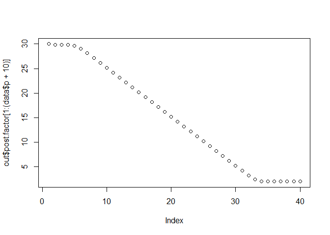
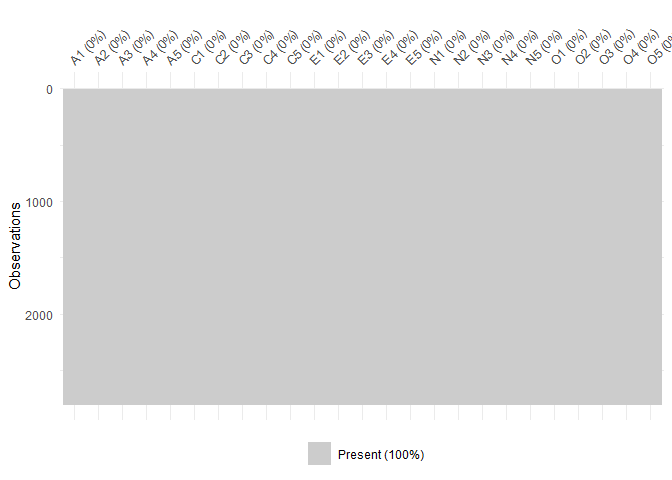
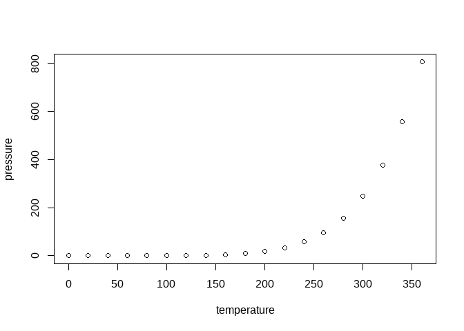

<!-- README.md is generated from README.Rmd. Please edit that file -->

# SBIFM

<!-- badges: start -->
<!-- badges: end -->

The goal of SBIFM is to …

## Installation

You can install the development version of SBIFM from
[GitHub](https://github.com/) with:

``` r
# install.packages("devtools")
devtools::install_github("RivuROX913/SBIFM")
```

## Example

This is a basic example which shows you how to solve a common problem:

``` r
library(SBIFM)
## basic example code

## Generate synthetic data
data = generateData(n = 200, p = 50, k = 10, rep = 5)
##analysis
out = GibbsCov(data, 20000, 5000, 3, 1e-4)
#> start replicate 1 
#> --------------------
#>   1000 
#>   2000 
#>   3000 
#>   4000 
#>   5000 
#>   6000 
#>   7000 
#>   8000 
#>   9000 
#>   10000 
#>   11000 
#>   12000 
#>   13000 
#>   14000 
#>   15000 
#>   16000 
#>   17000 
#>   18000 
#>   19000 
#>   20000 
#> end replicate 1 
#> --------------------
#> start replicate 2 
#> --------------------
#>   1000 
#>   2000 
#>   3000 
#>   4000 
#>   5000 
#>   6000 
#>   7000 
#>   8000 
#>   9000 
#>   10000 
#>   11000 
#>   12000 
#>   13000 
#>   14000 
#>   15000 
#>   16000 
#>   17000 
#>   18000 
#>   19000 
#>   20000 
#> end replicate 2 
#> --------------------
#> start replicate 3 
#> --------------------
#>   1000 
#>   2000 
#>   3000 
#>   4000 
#>   5000 
#>   6000 
#>   7000 
#>   8000 
#>   9000 
#>   10000 
#>   11000 
#>   12000 
#>   13000 
#>   14000 
#>   15000 
#>   16000 
#>   17000 
#>   18000 
#>   19000 
#>   20000 
#> end replicate 3 
#> --------------------
#> start replicate 4 
#> --------------------
#>   1000 
#>   2000 
#>   3000 
#>   4000 
#>   5000 
#>   6000 
#>   7000 
#>   8000 
#>   9000 
#>   10000 
#>   11000 
#>   12000 
#>   13000 
#>   14000 
#>   15000 
#>   16000 
#>   17000 
#>   18000 
#>   19000 
#>   20000 
#> end replicate 4 
#> --------------------
#> start replicate 5 
#> --------------------
#>   1000 
#>   2000 
#>   3000 
#>   4000 
#>   5000 
#>   6000 
#>   7000 
#>   8000 
#>   9000 
#>   10000 
#>   11000 
#>   12000 
#>   13000 
#>   14000 
#>   15000 
#>   16000 
#>   17000 
#>   18000 
#>   19000 
#>   20000 
#> end replicate 5 
#> --------------------


# Load the data
data <- psych::bfi[, 1:25]

head(data)
#>       A1 A2 A3 A4 A5 C1 C2 C3 C4 C5 E1 E2 E3 E4 E5 N1 N2 N3 N4 N5 O1 O2 O3 O4
#> 61617  2  4  3  4  4  2  3  3  4  4  3  3  3  4  4  3  4  2  2  3  3  6  3  4
#> 61618  2  4  5  2  5  5  4  4  3  4  1  1  6  4  3  3  3  3  5  5  4  2  4  3
#> 61620  5  4  5  4  4  4  5  4  2  5  2  4  4  4  5  4  5  4  2  3  4  2  5  5
#> 61621  4  4  6  5  5  4  4  3  5  5  5  3  4  4  4  2  5  2  4  1  3  3  4  3
#> 61622  2  3  3  4  5  4  4  5  3  2  2  2  5  4  5  2  3  4  4  3  3  3  4  3
#> 61623  6  6  5  6  5  6  6  6  1  3  2  1  6  5  6  3  5  2  2  3  4  3  5  6
#>       O5
#> 61617  3
#> 61618  3
#> 61620  2
#> 61621  5
#> 61622  3
#> 61623  1
#diagnose for missing value
dlookr::diagnose(data)
#> Registered S3 method overwritten by 'dlookr':
#>   method         from  
#>   plot.transform scales
#> # A tibble: 25 × 6
#>    variables types   missing_count missing_percent unique_count unique_rate
#>    <chr>     <chr>           <int>           <dbl>        <int>       <dbl>
#>  1 A1        integer            16           0.571            7      0.0025
#>  2 A2        integer            27           0.964            7      0.0025
#>  3 A3        integer            26           0.929            7      0.0025
#>  4 A4        integer            19           0.679            7      0.0025
#>  5 A5        integer            16           0.571            7      0.0025
#>  6 C1        integer            21           0.75             7      0.0025
#>  7 C2        integer            24           0.857            7      0.0025
#>  8 C3        integer            20           0.714            7      0.0025
#>  9 C4        integer            26           0.929            7      0.0025
#> 10 C5        integer            16           0.571            7      0.0025
#> # ℹ 15 more rows
visdat::vis_miss(data, sort_miss = FALSE)
```



``` r
#imputation
mice_model <- mice::mice(data, method='pmm', seed = 123)
#> 
#>  iter imp variable
#>   1   1  A1  A2  A3  A4  A5  C1  C2  C3  C4  C5  E1  E2  E3  E4  E5  N1  N2  N3  N4  N5  O1  O3  O4  O5
#>   1   2  A1  A2  A3  A4  A5  C1  C2  C3  C4  C5  E1  E2  E3  E4  E5  N1  N2  N3  N4  N5  O1  O3  O4  O5
#>   1   3  A1  A2  A3  A4  A5  C1  C2  C3  C4  C5  E1  E2  E3  E4  E5  N1  N2  N3  N4  N5  O1  O3  O4  O5
#>   1   4  A1  A2  A3  A4  A5  C1  C2  C3  C4  C5  E1  E2  E3  E4  E5  N1  N2  N3  N4  N5  O1  O3  O4  O5
#>   1   5  A1  A2  A3  A4  A5  C1  C2  C3  C4  C5  E1  E2  E3  E4  E5  N1  N2  N3  N4  N5  O1  O3  O4  O5
#>   2   1  A1  A2  A3  A4  A5  C1  C2  C3  C4  C5  E1  E2  E3  E4  E5  N1  N2  N3  N4  N5  O1  O3  O4  O5
#>   2   2  A1  A2  A3  A4  A5  C1  C2  C3  C4  C5  E1  E2  E3  E4  E5  N1  N2  N3  N4  N5  O1  O3  O4  O5
#>   2   3  A1  A2  A3  A4  A5  C1  C2  C3  C4  C5  E1  E2  E3  E4  E5  N1  N2  N3  N4  N5  O1  O3  O4  O5
#>   2   4  A1  A2  A3  A4  A5  C1  C2  C3  C4  C5  E1  E2  E3  E4  E5  N1  N2  N3  N4  N5  O1  O3  O4  O5
#>   2   5  A1  A2  A3  A4  A5  C1  C2  C3  C4  C5  E1  E2  E3  E4  E5  N1  N2  N3  N4  N5  O1  O3  O4  O5
#>   3   1  A1  A2  A3  A4  A5  C1  C2  C3  C4  C5  E1  E2  E3  E4  E5  N1  N2  N3  N4  N5  O1  O3  O4  O5
#>   3   2  A1  A2  A3  A4  A5  C1  C2  C3  C4  C5  E1  E2  E3  E4  E5  N1  N2  N3  N4  N5  O1  O3  O4  O5
#>   3   3  A1  A2  A3  A4  A5  C1  C2  C3  C4  C5  E1  E2  E3  E4  E5  N1  N2  N3  N4  N5  O1  O3  O4  O5
#>   3   4  A1  A2  A3  A4  A5  C1  C2  C3  C4  C5  E1  E2  E3  E4  E5  N1  N2  N3  N4  N5  O1  O3  O4  O5
#>   3   5  A1  A2  A3  A4  A5  C1  C2  C3  C4  C5  E1  E2  E3  E4  E5  N1  N2  N3  N4  N5  O1  O3  O4  O5
#>   4   1  A1  A2  A3  A4  A5  C1  C2  C3  C4  C5  E1  E2  E3  E4  E5  N1  N2  N3  N4  N5  O1  O3  O4  O5
#>   4   2  A1  A2  A3  A4  A5  C1  C2  C3  C4  C5  E1  E2  E3  E4  E5  N1  N2  N3  N4  N5  O1  O3  O4  O5
#>   4   3  A1  A2  A3  A4  A5  C1  C2  C3  C4  C5  E1  E2  E3  E4  E5  N1  N2  N3  N4  N5  O1  O3  O4  O5
#>   4   4  A1  A2  A3  A4  A5  C1  C2  C3  C4  C5  E1  E2  E3  E4  E5  N1  N2  N3  N4  N5  O1  O3  O4  O5
#>   4   5  A1  A2  A3  A4  A5  C1  C2  C3  C4  C5  E1  E2  E3  E4  E5  N1  N2  N3  N4  N5  O1  O3  O4  O5
#>   5   1  A1  A2  A3  A4  A5  C1  C2  C3  C4  C5  E1  E2  E3  E4  E5  N1  N2  N3  N4  N5  O1  O3  O4  O5
#>   5   2  A1  A2  A3  A4  A5  C1  C2  C3  C4  C5  E1  E2  E3  E4  E5  N1  N2  N3  N4  N5  O1  O3  O4  O5
#>   5   3  A1  A2  A3  A4  A5  C1  C2  C3  C4  C5  E1  E2  E3  E4  E5  N1  N2  N3  N4  N5  O1  O3  O4  O5
#>   5   4  A1  A2  A3  A4  A5  C1  C2  C3  C4  C5  E1  E2  E3  E4  E5  N1  N2  N3  N4  N5  O1  O3  O4  O5
#>   5   5  A1  A2  A3  A4  A5  C1  C2  C3  C4  C5  E1  E2  E3  E4  E5  N1  N2  N3  N4  N5  O1  O3  O4  O5
data_complete <- mice::complete(mice_model)

visdat::vis_miss(data_complete, sort_miss = FALSE)
```



``` r


##analysis
datalist = list( "data" = data_complete, "replicate" = 1, "n" = nrow(data_complete), "p" = ncol(data_complete) )

out = GibbsCov(datalist, 20000, 5000, 3, 1e-4)
#> start replicate 1 
#> --------------------
#>   1000 
#>   2000 
#>   3000 
#>   4000 
#>   5000 
#>   6000 
#>   7000 
#>   8000 
#>   9000 
#>   10000 
#>   11000 
#>   12000 
#>   13000 
#>   14000 
#>   15000 
#>   16000 
#>   17000 
#>   18000 
#>   19000 
#>   20000 
#> end replicate 1 
#> --------------------
```

What is special about using `README.Rmd` instead of just `README.md`?
You can include R chunks like so:

``` r
summary(cars)
#>      speed           dist       
#>  Min.   : 4.0   Min.   :  2.00  
#>  1st Qu.:12.0   1st Qu.: 26.00  
#>  Median :15.0   Median : 36.00  
#>  Mean   :15.4   Mean   : 42.98  
#>  3rd Qu.:19.0   3rd Qu.: 56.00  
#>  Max.   :25.0   Max.   :120.00
```

You’ll still need to render `README.Rmd` regularly, to keep `README.md`
up-to-date. `devtools::build_readme()` is handy for this.

You can also embed plots, for example:



In that case, don’t forget to commit and push the resulting figure
files, so they display on GitHub and CRAN.
