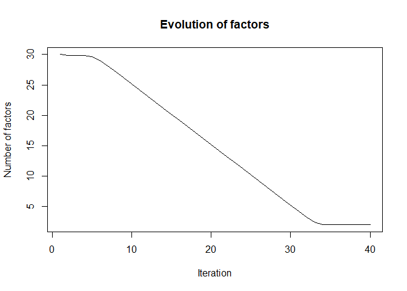
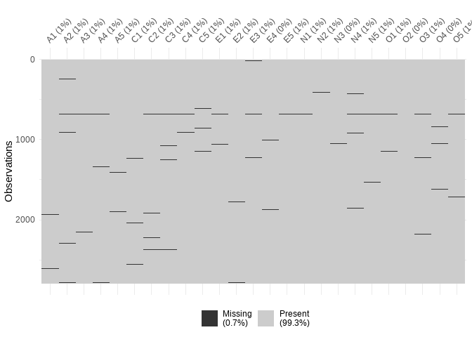
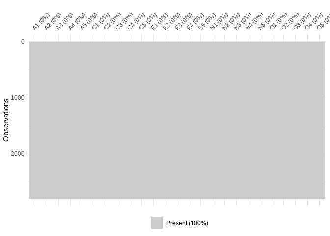

<!-- README.md is generated from README.Rmd. Please edit that file -->

# SBIFM

<!-- badges: start -->
<!-- badges: end -->

The goal of SBIFM is sparse modelling of high-dimensional covariance
matrices using Bayesian latent factor models. The method proposed by
[Bhattachrya et. al.](https://doi.org/10.1093/biomet/asr013) has been
used to develop an efficient Gibbs sampler that scales well as data
dimensionality increases. For automatically truncating the infinite
loading matrix through selection of the number of important factors, we
use the much more efficient truncation criteria proposed by [Schiavon
et. al.](https://doi.org/10.1002/sta4.298).

## Installation

You can install the development version of SBIFM from
[GitHub](https://github.com/) with:

``` r
# install.packages("devtools")
devtools::install_github("RivuROX913/SBIFM")
```

## Example

This is a basic example which shows applications of different functions:

``` r
library(SBIFM)

## Generate synthetic data
set.seed(2143)
data = generateData(n = 200, p = 30, k = 10, rep = 5)
tail(data)
#> $Lambda.train
#>              [,1]       [,2]        [,3]        [,4]        [,5]        [,6]
#>  [1,] -1.55202793  0.0000000  0.03564064  0.93199858 -1.12749760  0.00000000
#>  [2,] -1.14931686  0.0000000  0.25187921  0.83378768  0.75718749  0.00000000
#>  [3,]  1.47229291 -0.4618347  1.07116801  0.06760966  0.00000000 -0.78898483
#>  [4,] -1.71146529  0.0000000  0.00000000  0.00000000  0.00000000 -0.42073272
#>  [5,]  0.60445125  0.0000000  0.00000000  0.19153501 -1.04568552 -0.06607454
#>  [6,]  1.63654945  0.0000000 -1.75320233  0.26055188 -0.35179350 -0.85188068
#>  [7,]  0.22504839  0.5886428  0.00000000 -0.23520253  0.00000000  0.00000000
#>  [8,] -1.61363618  0.0000000  0.00000000 -0.10857597 -1.43252403  0.00000000
#>  [9,] -0.15582651 -0.4345329  0.00000000 -1.54950102 -1.14596107 -0.06970697
#> [10,] -0.30777171  0.0000000 -1.39116335 -0.46336021 -0.43007870  0.00000000
#> [11,] -0.21502258  0.0000000  0.00000000  0.68542192  1.16510207  1.10322400
#> [12,]  0.10011802  0.7355664 -0.08867718 -2.00822261  1.23959073  0.08389364
#> [13,] -0.53424234  0.0000000  0.00000000  0.89856983  0.68275803  1.20160322
#> [14,]  1.07990136  0.9714237 -1.29468386 -0.51552078  0.84863740  0.00000000
#> [15,] -0.80207619  0.5352235  0.00000000  2.74875160  1.64243596  1.03816052
#> [16,] -0.44109761  1.0490679  0.00000000 -0.88716477 -1.82774663 -1.00582752
#> [17,]  1.49326817  1.4383638  0.83830372 -0.95621827  0.06466902  0.00000000
#> [18,]  0.09826185  0.1444491 -0.67107410  1.08154705  0.00000000  0.00000000
#> [19,] -1.02526512  1.1321308 -0.07398279 -0.79449968 -0.52470344  0.00000000
#> [20,]  0.84117707  0.0000000  0.45474881 -0.86132859 -0.57884271  0.25747181
#> [21,]  0.32219082  1.7147060  0.65254586 -1.60632435  0.00000000  0.00000000
#> [22,] -0.22186848  0.0000000  0.00000000  0.29524952 -1.60887894  0.00000000
#> [23,]  1.14950908  1.0236575 -0.77038764 -0.13715951  0.00000000  0.05886028
#> [24,] -0.84821201 -1.0013702  0.00000000 -0.54444662  0.00000000  0.17557236
#> [25,] -0.99384239  1.3683471 -0.39369012  0.31332024  0.00000000  0.00000000
#> [26,] -0.12720440  1.0257478  0.00000000 -0.59911356 -0.94754147 -0.55096489
#> [27,] -1.14066003  0.0000000  0.00000000 -0.30311481  0.25845104  0.00000000
#> [28,]  1.85560657  0.0000000  0.00000000  0.61112430 -0.53165016  0.00000000
#> [29,]  0.79388126  0.0000000  0.00000000  0.00000000 -0.96923740 -0.34400367
#> [30,] -0.12026784  0.0000000  0.00000000  1.58159057  2.21431972 -1.60831566
#>              [,7]        [,8]        [,9]       [,10]
#>  [1,] -0.35945161  0.00000000  0.97268159  0.00000000
#>  [2,]  0.18036707  0.00000000  0.85539580  0.92262607
#>  [3,]  0.00000000  1.29500713  0.00000000  0.56243087
#>  [4,]  1.16984418  0.00000000 -0.23822150  0.00000000
#>  [5,]  0.00000000  0.00000000  0.83142957 -0.06965901
#>  [6,]  1.53429777 -0.26291269 -0.49236247  0.00000000
#>  [7,]  0.07851203  0.14577026  0.00000000  2.15728441
#>  [8,]  0.00000000  0.00000000  0.00000000 -0.76494278
#>  [9,]  0.00000000  0.00000000 -0.98471259  1.38666858
#> [10,]  0.00000000 -1.09281292  0.00000000  0.00000000
#> [11,]  1.39611451  1.47487234  0.00000000  0.00000000
#> [12,]  1.45957901  0.00000000  0.42622585  0.00000000
#> [13,]  0.00000000  0.00000000  0.00000000  0.00000000
#> [14,] -1.54489310  0.00000000  0.00000000  0.00000000
#> [15,]  0.00000000  0.00000000 -1.27139172  0.00000000
#> [16,]  0.00000000  0.00000000  0.00000000  0.00000000
#> [17,] -0.35102524  0.97975710  0.00000000  1.54198083
#> [18,]  0.00000000  0.00000000  0.05805937 -1.64421057
#> [19,]  0.80304530  0.00000000  0.00000000  0.00000000
#> [20,] -1.01805161  0.54065789 -1.43225064  0.00000000
#> [21,]  0.00000000  0.77880978 -0.60418659  0.59725730
#> [22,] -1.55506895 -1.08391408 -0.30422567  0.00000000
#> [23,]  1.32178966  1.21835049  1.70255263  0.00000000
#> [24,]  1.18614991  0.08825097  0.54080567  0.82218269
#> [25,] -1.41453184 -0.01993325  2.09804359 -0.71700799
#> [26,]  0.00000000  0.00000000  0.00000000  0.00000000
#> [27,]  1.13276773 -1.37164096  0.00000000  0.00000000
#> [28,]  0.53339640  0.00000000  0.35431176  0.00000000
#> [29,]  0.24803981  0.00000000  0.00000000  0.13390583
#> [30,]  0.00000000  0.00000000  0.59653705  0.00000000
#> 
#> $replicate
#> [1] 5
#> 
#> $n
#> [1] 200
#> 
#> $p
#> [1] 30
#> 
#> $k.train
#> [1] 10
#> 
#> $rank.train
#> [1] 10
```

The function `generateDat()` generates a sparse loading matrix with
given parameters and returns factor model data with that loading matrix
along with other true parameters.

``` r
## Analysis
out = GibbsCov(data, 10000, 3000, 7, 1e-4)
#> start replicate 1 
#> --------------------
#>   1000 
#>   2000 
#>   3000 
#>   4000 
#>   5000 
#>   6000 
#>   7000 
#>   8000 
#>   9000 
#>   10000 
#> end replicate 1 
#> --------------------
#> start replicate 2 
#> --------------------
#>   1000 
#>   2000 
#>   3000 
#>   4000 
#>   5000 
#>   6000 
#>   7000 
#>   8000 
#>   9000 
#>   10000 
#> end replicate 2 
#> --------------------
#> start replicate 3 
#> --------------------
#>   1000 
#>   2000 
#>   3000 
#>   4000 
#>   5000 
#>   6000 
#>   7000 
#>   8000 
#>   9000 
#>   10000 
#> end replicate 3 
#> --------------------
#> start replicate 4 
#> --------------------
#>   1000 
#>   2000 
#>   3000 
#>   4000 
#>   5000 
#>   6000 
#>   7000 
#>   8000 
#>   9000 
#>   10000 
#> end replicate 4 
#> --------------------
#> start replicate 5 
#> --------------------
#>   1000 
#>   2000 
#>   3000 
#>   4000 
#>   5000 
#>   6000 
#>   7000 
#>   8000 
#>   9000 
#>   10000 
#> end replicate 5 
#> --------------------
```

The function `GibsCov()` runs the MCMC algorithm to estimate the
covariance matrix and number of factors needed. If the true Covariance
matrix is included in the data, it also returns the error in estimation:

``` r
## Error in covariance estimation
out$MSE
#>          [,1]     [,2]     [,3]
#> [1,] 77.97521 3.325681 56.77403
#> [2,] 82.31437 3.348891 57.78944
#> [3,] 94.92937 3.540395 62.71355
#> [4,] 79.53688 3.349572 57.61390
#> [5,] 88.63750 3.464929 60.44856

## Convergence rate
plot(out$post.factor[1:(data$p+10)], type = "l", xlab = "Iteration", ylab = "Number of factors", main = "Evolution of factors")
```



Above plot shows the average factors in the model across iterations for
multiple replications of the data. As we can see, the convergence rate
of the factors is almost linear.

The function `imputeData()` was made to help users in handling real
datasets. To show a brief example we consider the `bfi` dataset included
in the `psych` package that contains 25 personality items taken from the
International Item Pool. For more details regarding the data, [see
this](https://pmagunia.com/dataset/r-dataset-package-psych-bfi).

`imputeData()` function can make a list suitable as an input to the
function `GibbsCov()`. It can also impute any missing data if necessary.
Following results show the amount of missing data before and after
applying the function:

``` r
# Real data and visualisation
library(psych)
library(dlookr, quietly = TRUE)
#> Registered S3 method overwritten by 'dlookr':
#>   method         from  
#>   plot.transform scales
#> 
#> Attaching package: 'dlookr'
#> The following object is masked from 'package:psych':
#> 
#>     describe
#> The following object is masked from 'package:base':
#> 
#>     transform
library(visdat)

## Dataset
data = bfi[, 1:25]
head(data)
#>       A1 A2 A3 A4 A5 C1 C2 C3 C4 C5 E1 E2 E3 E4 E5 N1 N2 N3 N4 N5 O1 O2 O3 O4
#> 61617  2  4  3  4  4  2  3  3  4  4  3  3  3  4  4  3  4  2  2  3  3  6  3  4
#> 61618  2  4  5  2  5  5  4  4  3  4  1  1  6  4  3  3  3  3  5  5  4  2  4  3
#> 61620  5  4  5  4  4  4  5  4  2  5  2  4  4  4  5  4  5  4  2  3  4  2  5  5
#> 61621  4  4  6  5  5  4  4  3  5  5  5  3  4  4  4  2  5  2  4  1  3  3  4  3
#> 61622  2  3  3  4  5  4  4  5  3  2  2  2  5  4  5  2  3  4  4  3  3  3  4  3
#> 61623  6  6  5  6  5  6  6  6  1  3  2  1  6  5  6  3  5  2  2  3  4  3  5  6
#>       O5
#> 61617  3
#> 61618  3
#> 61620  2
#> 61621  5
#> 61622  3
#> 61623  1

#diagnose for missing value
diagnose(data)
#> # A tibble: 25 × 6
#>    variables types   missing_count missing_percent unique_count unique_rate
#>    <chr>     <chr>           <int>           <dbl>        <int>       <dbl>
#>  1 A1        integer            16           0.571            7      0.0025
#>  2 A2        integer            27           0.964            7      0.0025
#>  3 A3        integer            26           0.929            7      0.0025
#>  4 A4        integer            19           0.679            7      0.0025
#>  5 A5        integer            16           0.571            7      0.0025
#>  6 C1        integer            21           0.75             7      0.0025
#>  7 C2        integer            24           0.857            7      0.0025
#>  8 C3        integer            20           0.714            7      0.0025
#>  9 C4        integer            26           0.929            7      0.0025
#> 10 C5        integer            16           0.571            7      0.0025
#> # ℹ 15 more rows
vis_miss(data, sort_miss = FALSE)
```



``` r

#imputation
datalist = imputeData(data)
#> 
#>  iter imp variable
#>   1   1  A1  A2  A3  A4  A5  C1  C2  C3  C4  C5  E1  E2  E3  E4  E5  N1  N2  N3  N4  N5  O1  O3  O4  O5
#>   1   2  A1  A2  A3  A4  A5  C1  C2  C3  C4  C5  E1  E2  E3  E4  E5  N1  N2  N3  N4  N5  O1  O3  O4  O5
#>   1   3  A1  A2  A3  A4  A5  C1  C2  C3  C4  C5  E1  E2  E3  E4  E5  N1  N2  N3  N4  N5  O1  O3  O4  O5
#>   1   4  A1  A2  A3  A4  A5  C1  C2  C3  C4  C5  E1  E2  E3  E4  E5  N1  N2  N3  N4  N5  O1  O3  O4  O5
#>   1   5  A1  A2  A3  A4  A5  C1  C2  C3  C4  C5  E1  E2  E3  E4  E5  N1  N2  N3  N4  N5  O1  O3  O4  O5
#>   2   1  A1  A2  A3  A4  A5  C1  C2  C3  C4  C5  E1  E2  E3  E4  E5  N1  N2  N3  N4  N5  O1  O3  O4  O5
#>   2   2  A1  A2  A3  A4  A5  C1  C2  C3  C4  C5  E1  E2  E3  E4  E5  N1  N2  N3  N4  N5  O1  O3  O4  O5
#>   2   3  A1  A2  A3  A4  A5  C1  C2  C3  C4  C5  E1  E2  E3  E4  E5  N1  N2  N3  N4  N5  O1  O3  O4  O5
#>   2   4  A1  A2  A3  A4  A5  C1  C2  C3  C4  C5  E1  E2  E3  E4  E5  N1  N2  N3  N4  N5  O1  O3  O4  O5
#>   2   5  A1  A2  A3  A4  A5  C1  C2  C3  C4  C5  E1  E2  E3  E4  E5  N1  N2  N3  N4  N5  O1  O3  O4  O5
#>   3   1  A1  A2  A3  A4  A5  C1  C2  C3  C4  C5  E1  E2  E3  E4  E5  N1  N2  N3  N4  N5  O1  O3  O4  O5
#>   3   2  A1  A2  A3  A4  A5  C1  C2  C3  C4  C5  E1  E2  E3  E4  E5  N1  N2  N3  N4  N5  O1  O3  O4  O5
#>   3   3  A1  A2  A3  A4  A5  C1  C2  C3  C4  C5  E1  E2  E3  E4  E5  N1  N2  N3  N4  N5  O1  O3  O4  O5
#>   3   4  A1  A2  A3  A4  A5  C1  C2  C3  C4  C5  E1  E2  E3  E4  E5  N1  N2  N3  N4  N5  O1  O3  O4  O5
#>   3   5  A1  A2  A3  A4  A5  C1  C2  C3  C4  C5  E1  E2  E3  E4  E5  N1  N2  N3  N4  N5  O1  O3  O4  O5
#>   4   1  A1  A2  A3  A4  A5  C1  C2  C3  C4  C5  E1  E2  E3  E4  E5  N1  N2  N3  N4  N5  O1  O3  O4  O5
#>   4   2  A1  A2  A3  A4  A5  C1  C2  C3  C4  C5  E1  E2  E3  E4  E5  N1  N2  N3  N4  N5  O1  O3  O4  O5
#>   4   3  A1  A2  A3  A4  A5  C1  C2  C3  C4  C5  E1  E2  E3  E4  E5  N1  N2  N3  N4  N5  O1  O3  O4  O5
#>   4   4  A1  A2  A3  A4  A5  C1  C2  C3  C4  C5  E1  E2  E3  E4  E5  N1  N2  N3  N4  N5  O1  O3  O4  O5
#>   4   5  A1  A2  A3  A4  A5  C1  C2  C3  C4  C5  E1  E2  E3  E4  E5  N1  N2  N3  N4  N5  O1  O3  O4  O5
#>   5   1  A1  A2  A3  A4  A5  C1  C2  C3  C4  C5  E1  E2  E3  E4  E5  N1  N2  N3  N4  N5  O1  O3  O4  O5
#>   5   2  A1  A2  A3  A4  A5  C1  C2  C3  C4  C5  E1  E2  E3  E4  E5  N1  N2  N3  N4  N5  O1  O3  O4  O5
#>   5   3  A1  A2  A3  A4  A5  C1  C2  C3  C4  C5  E1  E2  E3  E4  E5  N1  N2  N3  N4  N5  O1  O3  O4  O5
#>   5   4  A1  A2  A3  A4  A5  C1  C2  C3  C4  C5  E1  E2  E3  E4  E5  N1  N2  N3  N4  N5  O1  O3  O4  O5
#>   5   5  A1  A2  A3  A4  A5  C1  C2  C3  C4  C5  E1  E2  E3  E4  E5  N1  N2  N3  N4  N5  O1  O3  O4  O5

##completed data
vis_miss(datalist$data, sort_miss = FALSE)
```



Applying `GibbsCov()` on above imputed dataset shows that the 25
personality traits actually depends on only 6 factors:

``` r
out = GibbsCov(datalist, 20000, 5000, 3, 1e-4)
#> start replicate 1 
#> --------------------
#>   1000 
#>   2000 
#>   3000 
#>   4000 
#>   5000 
#>   6000 
#>   7000 
#>   8000 
#>   9000 
#>   10000 
#>   11000 
#>   12000 
#>   13000 
#>   14000 
#>   15000 
#>   16000 
#>   17000 
#>   18000 
#>   19000 
#>   20000 
#> end replicate 1 
#> --------------------
out$Factor
#> [1] 6
```
